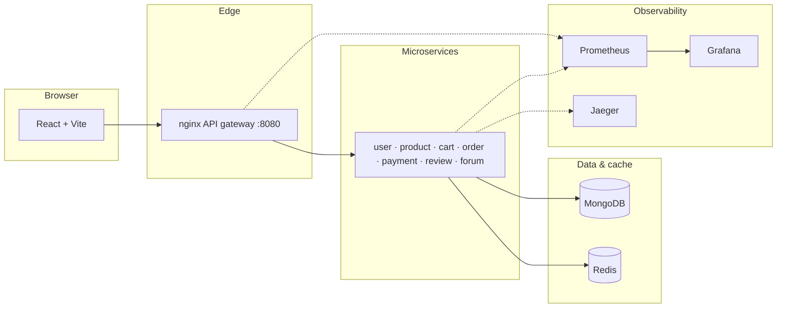

# BitForge — DIY Maker Kits Marketplace

[](https://opensource.org/licenses/MIT)
[](https://github.com/madhu9502651/bitforge/actions/workflows/ci.yml)
[](https://nodejs.org/)
[](https://docs.docker.com/compose/)

**BitForge** is a full-stack **microservices** platform for a **DIY maker kits** marketplace: kits, customization, and maker workflows—not a generic retail clone. The **center of gravity is the backend**: an **nginx API gateway**, Node.js services, **MongoDB** (database-per-service boundaries), **Redis**, and **observability** (Prometheus, Grafana, Jaeger) with optional **Kubernetes** and Terraform for deployment.

> **Course context:** **AOS (Advanced Operating Systems)** — **Project-3 (Kubernetes cluster management)**. This repo is a demonstrable microservices stack: **Docker Compose** locally, manifests under `k8s/`, and observability suitable for cluster operations review.

---

## Highlights

- **Gateway-first API** — nginx routing, health surfaces, and controlled ingress (`gateway/`)
- **Seven domain services** — user, product, cart, order, payment, review, forum (`microservices/`)
- **Operational visibility** — `/metrics`, OpenTelemetry → Jaeger, Prometheus + Grafana (`infra/`)
- **React + TypeScript UI** — Vite dev server with API proxy to the gateway (`frontend/`)
- **Load & integration harnesses** — k6 scripts (`load/`), integration tests (`tests/`), CI in `.github/workflows/`

---

## Tech stack

| Layer | Technology |
|--------|------------|
| **Client** | React 18, TypeScript, Vite (`frontend/`) |
| **Gateway** | nginx (`gateway/nginx.conf`) |
| **Services** | Node.js, Express (`microservices/*`) |
| **Data** | MongoDB 7 (logical per-service DBs), Redis |
| **Observability** | Prometheus, Grafana, Jaeger (OTel collector) |
| **Deploy** | Docker Compose, Kubernetes (`k8s/`), optional GKE Terraform (`infra/terraform/gke/`) |

---

## Architecture (high level)



**Request path:** `React (Vite)` → `nginx :8080` → `microservices` → `MongoDB` / `Redis`

Deeper alignment with course artifacts: [`docs/REFERENCE_RECONCILIATION.md`](docs/REFERENCE_RECONCILIATION.md).

---

## Table of contents

- [Quick start](#quick-start)
- [Optional Next.js at repo root](#optional-nextjs-at-repo-root)
- [Repository layout](#repository-layout)
- [Prerequisites](#prerequisites)
- [Run locally](#run-locally)
- [Health checks & monitoring](#health-checks--monitoring)
- [Configuration & security](#configuration--security)
- [Testing & CI](#testing--ci)
- [Kubernetes & Terraform](#kubernetes--terraform)
- [Documentation](#documentation)
- [Source repository](#source-repository)
- [Contributing](CONTRIBUTING.md)
- [Project positioning](#project-positioning)

---

## Quick start

```bash
git clone https://github.com/madhu9502651/bitforge.git
cd bitforge
docker compose up --build
```

In a **second terminal**:

```bash
cd frontend
npm install
npm run dev
```

Open **http://localhost:5173** (Vite). The API is proxied to the gateway at **http://localhost:8080**.  
Run **`docker compose down`** if ports **6379**, **4317**, or others are already in use on your machine.

Full details, URLs, and demo accounts: [Run locally](#run-locally).

### Optional Next.js at repo root

Some checkouts include a **root-level Next.js** app (`app/`, root `package.json`, `next.config.*`) in addition to **`frontend/`** (Vite). For that layout, from the repository root:

```bash
npm install
npm run dev
```

Then open **http://localhost:3000** (or the URL the dev server prints). Confirm script names in root `package.json` if your branch differs.

For **AOS demos and this README’s primary path**, the stack is still **Docker Compose + nginx gateway + `frontend/` (Vite)** unless your course explicitly standardizes on Next. The two clients can coexist for experiments or migration. Further framework details: [Next.js documentation](https://nextjs.org/docs).

---

## Repository layout

| Path | Purpose |
|------|---------|
| `frontend/` | Vite app; proxies `/api` to gateway port 8080 in dev |
| `gateway/` | nginx — routing, `/health`, `/api/*` — [`gateway/README.md`](gateway/README.md) |
| `microservices/` | Seven Node.js services — [`microservices/README.md`](microservices/README.md) |
| `assets/` | Marketplace imagery — [`assets/README.md`](assets/README.md) |
| `infra/` | Prometheus, Grafana, OTel — [`infra/README.md`](infra/README.md) |
| `k8s/` | Kubernetes manifests — `k8s/README.md` |
| `infra/terraform/gke/` | Optional GKE baseline |
| `load/k6/` | k6 workloads — [`load/README.md`](load/README.md) |
| `tests/` | Integration checks — [`tests/README.md`](tests/README.md) |
| `scripts/` | Helpers — [`scripts/README.md`](scripts/README.md) |
| `team-handoffs/` | Optional teammate bundles (ZIPs gitignored) |
| `.github/workflows/` | CI — lint, tests, integration |
| `docs/` | Deployment, load/HPA, reconciliation — [`docs/README.md`](docs/README.md) |
| `docker-compose.yml` | Full local stack (gateway, services, Mongo, Redis, Jaeger, Prometheus, Grafana) |

See [`CONTRIBUTING.md`](CONTRIBUTING.md) for branch and commit conventions.

---

## Prerequisites

- **Docker Desktop** (or Docker Engine) + **Docker Compose v2**
- **Node.js 18+** and npm (frontend and local tooling)

---

## Run locally

### 1. Backend, gateway, databases, observability

```bash
cd <repository-root>   # folder where this README and docker-compose.yml live
docker compose up --build
```

Leave this running. First start builds images and may take several minutes.

If Compose fails with **“port is already allocated”** (often **6379** or **4317**), stop other stacks (`docker compose down` in other project folders) or run **`docker compose down`** here and retry. Redis is published on host **6380** (not 6379) to reduce clashes; apps inside Docker still use **`redis:6379`**.

### 2. Frontend (separate terminal)

```bash
cd <repository-root>/frontend
npm install
npm run dev
```

Open the URL Vite prints (default **http://localhost:5173**). API calls go to **http://localhost:8080** via the Vite dev proxy (`vite.config.ts`).

### Useful URLs (compose running)

| Endpoint | Purpose |
|----------|---------|
| http://localhost:8080/health | Gateway liveness |
| http://localhost:8080/health/details | Gateway + pointers to upstream checks |
| http://localhost:8080/health/upstream/product | Example: product-service through gateway |
| http://localhost:9090 | Prometheus |
| http://localhost:3000 | Grafana (`GF_SECURITY_ADMIN_USER` / `GF_SECURITY_ADMIN_PASSWORD` in `docker-compose.yml`) |
| http://localhost:16686 | Jaeger UI |

**Direct service ports (debugging):** user `8001`, product `8002`, order `8003`, payment `8004`, forum `8005`, cart `8006`, review `8007`.

### Demo accounts

- **Admin:** `admin@maker.local` / `admin123` (when seeded via user-service)
- Register additional users at `/register`

### Product catalog seeding

Product data is loaded from `microservices/product-service/seed.js` when the product service starts. If you use **Docker’s MongoDB** and also run Mongo on the host, ensure you seed the **same** database the app uses. A helper script exists: `microservices/product-service/scripts/syncSeed.js` (see `npm run seed` in that package). Flush Redis keys for `products:*` after catalog changes if responses look stale.

---

## Health checks & monitoring

- **Gateway:** `GET /health`, `GET /health/ready`, `GET /health/upstream/{user|product|order|payment|cart|review|forum}`
- **Each microservice:** `GET /health` and `GET /metrics` (Prometheus)
- **Prometheus** scrapes all services and nginx metrics (see `infra/prometheus/prometheus.yml`)
- **Grafana** is pre-provisioned with a Prometheus datasource (`infra/grafana/provisioning/`)

Use **Prometheus → Status → Targets** to confirm all jobs are **UP** when diagnosing the stack.

---

## Configuration & security

- Copy patterns from `k8s/secret.example.yaml` for real clusters; **do not** commit live secrets.
- Compose uses `JWT_SECRET` and `SERVICE_TOKEN` defaults suitable **only for local development** — change them for any shared or production environment.
- `.env` files are gitignored; use environment variables or compose overrides for secrets.

---

## Testing & CI

- **Frontend:** Vitest / Testing Library; **E2E:** Playwright (`frontend/e2e/`)
- **Services:** Node’s built-in test runner where configured (`npm test` per service)
- **Integration:** Gateway and checkout flows under `tests/` and CI workflow
- **CI:** `.github/workflows/ci.yml` — install, lint, unit tests, build, integration where enabled

Run locally before pushing:

```bash
# Example: frontend
cd frontend && npm run lint && npm test

# Example: product-service
cd microservices/product-service && npm test
```

---

## Kubernetes & Terraform

```bash
kubectl apply -f k8s/namespace.yaml
kubectl apply -f k8s/configmap.yaml
# Use a real Secret in production — see k8s/secret.example.yaml
kubectl apply -f k8s/deployments.yaml
```

Details: [`k8s/README.md`](k8s/README.md). GKE-oriented notes: [`docs/GKE_DEPLOYMENT.md`](docs/GKE_DEPLOYMENT.md). Terraform: `infra/terraform/gke/` (see `terraform.tfvars.example`).

---

## Documentation

| Document | Description |
|----------|-------------|
| [`docs/README.md`](docs/README.md) | Index of in-repo technical docs |
| [`docs/REFERENCE_RECONCILIATION.md`](docs/REFERENCE_RECONCILIATION.md) | Alignment of course decks and proposals with this implementation |
| [`docs/GKE_DEPLOYMENT.md`](docs/GKE_DEPLOYMENT.md) | Optional GKE / Terraform-oriented deployment notes |
| [`docs/LOAD_HPA_EVIDENCE.md`](docs/LOAD_HPA_EVIDENCE.md) | Load and scaling evidence narrative |
| [`docs/TEAM_CODE_SPLIT.md`](docs/TEAM_CODE_SPLIT.md) | Ownership map for teammate commits |

---

## Source repository

**Canonical remote:** [github.com/madhu9502651/bitforge](https://github.com/madhu9502651/bitforge)

```bash
git clone https://github.com/madhu9502651/bitforge.git
cd bitforge
```

Related lineage: [github.com/ranjithguggilla/bitforge](https://github.com/ranjithguggilla/bitforge) (verify with `git remote -v` on your checkout).

---

## Project positioning

BitForge targets **maker kits and hands-on builds**—a different problem space than mass-market e‑commerce (e.g. broad retail catalogs). The implementation is designed to **showcase microservices in depth**: clear service boundaries, gateway-mediated APIs, resilient patterns (caching, idempotency where applicable), **JWT + service-to-service auth**, and **full-stack observability** so behavior under load and failure modes can be inspected—not a thin CRUD demo. That backend emphasis is intentional: it is what distinguishes this platform architecturally from “another online shop” and keeps the demonstration **strong, inspectable, and safety-conscious** for real distributed-systems practice.
